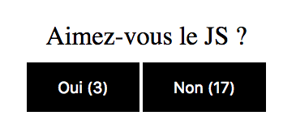
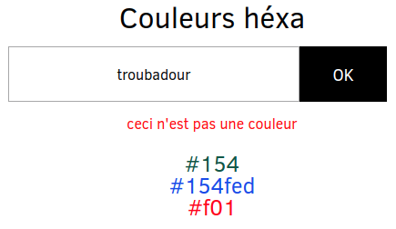

# Clic !

## Exo 1 : compteur

Créer un compteur de clics.

## Exo 2 : sondage

On peut cliquer sur deux boutons, et il faut compter le nombre de clics sur chacun d'eux :

## Exo 3 : liste de courses

1. Récupérer le contenu d'un input à la soumission du formulaire
2. Si pas de contenu, message d'erreur dans la console
3. Si une `value` existe, on ajoute un nouvel élément dans la liste ordonnée `<ol>`

## BONUS Exo 4 : couleurs

Un peu sur le modèle de l'exo 3, on veut gérer un formulaire permettant d'ajouter des couleurs (format hexadécimal ex: #FA943B) dans une liste non ordonnée `<ul>`
1. on veut intercepter la soumission du formulaire, pour cela :
    - il nous faut sélectionner l'élément formulaire
    - puis lui ajouter un écouteur d'évènement
1. dans la fonction handler :
    - empêcher le rechargement automatique de la page après l'envoi du formulaire
    - récupérer la couleur saisie par l'utilisateur
    - créer un `<li>` pour ajouter la nouvelle couleur dans la liste `<ul>`

## SUPER BONUS Suite Exo 4
1. on supprime le contenu du champ input après validation du formulaire (pour éviter à l'utilisateur de devoir le faire lui même avant de saisir une nouvelle valeur)
1. vérifier qu'il s'agit bien d'une couleur au format hexadécimal avant de l'ajouter dans la liste :
    - => une couleur au format hexadécimal doit commencer par un #
    - => elle peut faire 4 caractères (ex: #FFF) ou 7 caractères (ex: #FFFFFF)
    - si la couleur n'est pas valide, afficher un message d'erreur
    - si la couleur est au bon format, l'ajouter dans la liste `<ul>`
1. amélioration de l'affichage : si la couleur est bonne, le contenu du `<li>` ajouté doit s'afficher dans la couleur correspondante (s'affiche en rouge si on saisit : #FF0000)

